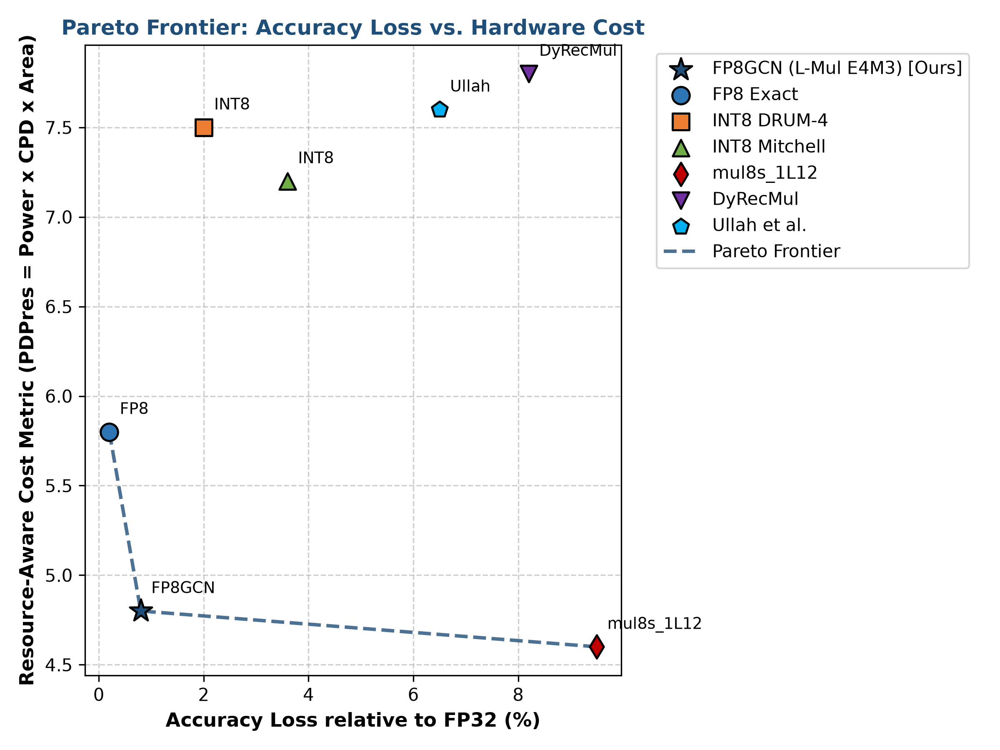
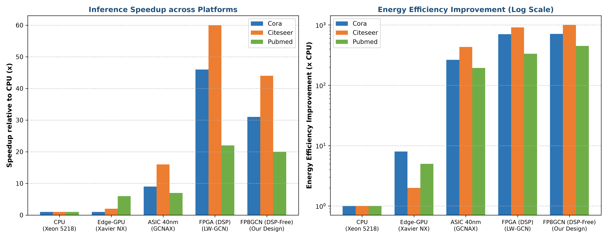

# FP8GCN: An Edge-FPGA-Based Graph Convolutional Network Accelerator with FP8 Approximate Multipliers (DSP-Free)

[](hardware/rtl)
[](hardware/syn)
[](hardware/tb)
[](software)
[](hardware/syn)
[](LICENSE)

---

## 📌 Overview

**FP8GCN** is a complete, hardware/software co-designed **DSP-Free Graph Convolutional Network (GCN) Accelerator** tailored for resource- and power-constrained **Edge-FPGA platforms** (e.g., AMD-Xilinx Zynq-7020, ZCU106, Artix-7, Kintex-7).

Standard deep learning accelerators on FPGAs suffer from severe resource bottlenecks:
1. **Memory-bound bottleneck:** Feature Aggregation ($A \times H$) requires Sparse-Dense Matrix Multiplication (SpMM), leading to irregular off-chip DRAM accesses.
2. **Compute & Energy bottleneck:** Feature Transformation ($H \times W$) relies on dense GEMMs, which rapidly exhaust dedicated on-chip **DSP slices** (DSP48E1 / DSP48E2).

### 🚀 Key Innovations & Contributions:
* **100% DSP-Free Architecture (0 DSPs Used):** Replaces hardware DSP blocks with lightweight **FP8 L-Mul (Linear Multiplication)** approximate multipliers mapped entirely onto standard 6-LUT logic and fast carry chains (CARRY4 / CARRY8).
* **Minimal Accuracy Drop ($< 1.0\%$):** Evaluated across standard citation graph benchmarks (**Cora, Citeseer, Pubmed**), the FP8 E4M3 L-Mul design demonstrates near-lossless inference ($0.20\% - 1.00\%$ degradation compared to FP32 baselines, outperforming INT8 DRUM-4 and Mitchell multipliers).
* **Gustavson-based 256-PE Unified Compute Array:** 16 PE groups $\times$ 16 vector dimension process SpMM and GEMM under a unified, pipelined dataflow with zero structural stalls.
* **Double-Buffering Ping-Pong SRAM:** Minimizes DMA transfer latency to achieve continuous streaming between off-chip memory and on-chip compute units.
* **High Frequency & Power Efficiency:** Operates at **200 MHz** clock frequency with an estimated core dynamic power of **5.44 W**, delivering **$31\times - 44\times$ speedup** and **$712\times - 1010\times$ higher energy efficiency** compared to high-end Intel Xeon CPUs.

---

## 📐 Mathematical Foundations

### 1. GCN Layer Forward Propagation
For a standard 2-layer Graph Convolutional Network (Kipf & Welling):
$$\mathbf{H}^{(l+1)} = \sigma\left( \mathbf{\hat{A}} \mathbf{H}^{(l)} \mathbf{W}^{(l)} \right)$$
where:
* $\mathbf{\hat{A}} = \mathbf{\tilde{D}}^{-\frac{1}{2}} \mathbf{\tilde{A}} \mathbf{\tilde{D}}^{-\frac{1}{2}}$ is the symmetrically normalized adjacency matrix with added self-loops ($\mathbf{\tilde{A}} = \mathbf{A} + \mathbf{I}_N$).
* $\mathbf{H}^{(l)}$ is the feature matrix at layer $l$.
* $\mathbf{W}^{(l)}$ is the trainable weight matrix.
* $\sigma(\cdot)$ is the non-linear activation function (ReLU).

### 2. Execution Ordering Optimization: $\mathbf{A}(\mathbf{X}\mathbf{W})$ vs $(\mathbf{A}\mathbf{X})\mathbf{W}$
In sparse graphs where feature dimension $F \gg C$ (e.g., Cora: $F=1433, C=7$, hidden $d=16$):
* Computing $(\mathbf{A}\mathbf{X})\mathbf{W}$ requires performing SpMM on an $N \times 1433$ dense matrix.
* Computing $\mathbf{A}(\mathbf{X}\mathbf{W})$ performs GEMM first ($\mathbf{X}\mathbf{W} \rightarrow N \times 16$), reducing total arithmetic operations by **$\approx 32\times$**, and allowing the unified PE array to process both phases seamlessly.

### 3. FP8 L-Mul Approximate Multiplier Formulation
In the IEEE-compatible 8-bit floating-point format (**FP8 E4M3**: 1 sign bit, 4 exponent bits with bias=7, 3 mantissa bits):
$$x = (-1)^{s_x} \cdot 2^{E_x - 7} \cdot (1 + m_x), \quad y = (-1)^{s_y} \cdot 2^{E_y - 7} \cdot (1 + m_y)$$

An exact floating-point multiplier requires computing the non-linear mantissa cross-product $m_x \cdot m_y$:
$$x \cdot y = (-1)^{s_x \oplus s_y} \cdot 2^{(E_x + E_y - 14)} \cdot \left(1 + m_x + m_y + \mathbf{m_x \cdot m_y}\right)$$

The **L-Mul (Linear Multiplication)** algorithm eliminates the non-linear mantissa multiplier by replacing $m_x \cdot m_y$ with a piecewise constant $2^{-l(m)}$:
$$\text{L-Mul}(x, y) = (-1)^{s_x \oplus s_y} \cdot 2^{(E_x + E_y - 14)} \cdot \left(1 + m_x + m_y + 2^{-l(m)}\right)$$

For FP8 E4M3 ($m = 3$ bits), $l(3) = 3 \implies 2^{-3} = \frac{1}{8}$ (exactly 1 LSB). In integer representation:
$$8 \cdot M_{\text{res}} = 8 + \text{man}_x + \text{man}_y + 1$$

> **Hardware implication:** The entire mantissa multiplication is replaced by a single 3-operand adder (`8 + man_x + man_y + 1`). It synthesizes directly into 6-input LUTs and carry-chains in **1 clock cycle with 0 DSPs**.

---

## 🏛️ Hardware Architecture

The top-level accelerator architecture consists of six core functional units:

```
                          ┌────────────────────────────────────────────────────────┐
                          │                FP8GCN Accelerator Core                 │
                          │                                                        │
   Off-Chip DDR Memory    │   ┌────────────────────────────────────────────────┐   │
   [Nodes, Adjacency, W]  │   │          Double-Buffering Ping-Pong SRAM       │   │
            │             │   │  - Info Buffer   - Sparse Buffer - Dense Buffer│   │
            │ DMA Stream  │   └───────────────────────┬────────────────────────┘   │
            ▼             │                           │ Broadcast                  │
   ┌──────────────────┐   │                           ▼                            │
   │  AXI4-Stream /   ├───┼──►┌────────────────────────────────────────────────┐   │
   │  AXI-Lite Wrapper│   │   │       Unified 256-PE Approximate Array         │   │
   └──────────────────┘   │   │  - 16 PE Groups x 16 Vector Lanes              │   │
            ▲             │   │  - 256 x FP8 L-Mul Multipliers (0 DSP Slices)  │   │
            │ Output Data │   └───────────────────────┬────────────────────────┘   │
            │             │                           ▼                            │
            │             │   ┌────────────────────────────────────────────────┐   │
            │             │   │   4-Stage Pipelined Reduction Tree (16 -> 1)   │   │
            │             │   └───────────────────────┬────────────────────────┘   │
            │             │                           ▼                            │
            │             │   ┌────────────────────────────────────────────────┐   │
            │             │   │   Row Accumulator & Dynamic FP8 Re-quantizer   │   │
            │             │   └───────────────────────┬────────────────────────┘   │
            │             │                           ▼                            │
            │             │   ┌────────────────────────────────────────────────┐   │
            │             │   │     ReLU Activation Unit & Output Streaming    │   │
            │             │   └───────────────────────┬────────────────────────┘   │
            │             │                           ▼                            │
            └─────────────┼───────────────────────────┴────────────────────────────┘
                          │                 FSM Controller (5 States)              │
                          └────────────────────────────────────────────────────────┘
```

1. **Unified PE Array (`pe_array.v`):** Contains 16 PE groups, each with 16 parallel FP8 L-Mul units (total 256 multipliers). Executes 256 approximate MAC operations per cycle at 200 MHz.
2. **Ping-Pong Buffer (`ping_pong_buffer.v`):** Double-buffering on-chip SRAM structure compliant with Xilinx UG901 BRAM inference templates. Overlaps off-chip DMA prefetching with PE array computation.
3. **Pipelined Reduction Tree (`merger_tree.v`):** A 4-stage binary adder tree converting FP8 inputs to 16-bit fixed-point to accumulate partial sums without loss of precision.
4. **Row Accumulator (`accumulator.v`):** Accumulates intermediate inner products along graph node neighbor lists and dynamically converts 24-bit fixed-point values back into FP8.
5. **ReLU Activation Unit (`relu_unit.v`):** Single-cycle non-linear activation unit passing positive values and clipping negative values to zero.
6. **AXI4 SoC Wrapper (`fp8_gcn_axi_top.v`):** Integrates 32-bit AXI4-Stream data channels and AXI4-Lite control registers for standard Zynq/ZCU106 Processing System (PS) coupling.

---

## 📁 Repository Structure

```text
.
├── docs/                                  # Technical reports, benchmarks & Pareto curves
│   ├── BAO_CAO_TONG_KET_KY_THUAT.md       # Comprehensive Vietnamese engineering report
│   ├── pareto_frontier.png                # Accuracy vs. Power Pareto Frontier plot
│   └── performance_energy_comparison.png  # Speedup & Energy Efficiency comparison chart
├── hardware/                              # Complete Verilog RTL, Testbenches & Synthesis Scripts
│   ├── rtl/                               # Synthesizable RTL source files
│   │   ├── pe/                            # Processing element hierarchy
│   │   │   ├── fp8_lmul.v                 # Proposed DSP-free FP8 L-Mul approximate multiplier
│   │   │   ├── fp8_exact_mul.v            # Baseline exact FP8 multiplier (for PPA comparison)
│   │   │   ├── drum4_mul.v                # Baseline INT8 DRUM-4 approximate multiplier
│   │   │   ├── pe_unit.v                  # Single PE wrapper
│   │   │   ├── pe_group.v                 # 16-PE vector processing group
│   │   │   └── pe_array.v                 # Top 256-PE unified Gustavson array
│   │   ├── buffer/                        # On-chip memory subsystem
│   │   │   └── ping_pong_buffer.v         # Dual-bank BRAM double-buffering module
│   │   ├── merger_tree/                   # Post-processing and accumulation
│   │   │   ├── merger_tree.v              # 4-stage pipelined reduction tree
│   │   │   ├── accumulator.v              # Row-wise accumulator with FP8 re-quantization
│   │   │   └── relu_unit.v                # Single-cycle ReLU activation block
│   │   ├── controller/                    # Control path
│   │   │   └── gcn_controller.v           # 5-phase GCN FSM state machine
│   │   ├── fp8_gcn_top.v                  # Top-level accelerator core (OOC mode)
│   │   └── fp8_gcn_axi_top.v              # Top-level SoC wrapper (AXI-Stream / AXI-Lite)
│   ├── tb/                                # Verification testbenches
│   │   ├── tb_approx_multipliers.v        # Unit testbench for multiplier verification
│   │   └── tb_fp8_gcn_top.v               # System-level testbench with Cora test vectors
│   └── syn/                               # AMD Vivado synthesis & implementation files
│       ├── run_synth.tcl                  # Automated Vivado batch synthesis script
│       ├── create_vivado_project.tcl      # GUI project generator script
│       └── fp8_gcn_constraints.xdc        # 200 MHz timing & clock constraints
├── software/                              # Python simulation, quantization & verification
│   ├── models/                            # PyTorch model definitions
│   │   └── gcn.py                         # 2-layer GCN reference architecture
│   ├── quantization/                      # Quantization routines
│   │   └── fp8.py                         # Bit-accurate FP8 E4M3 / E5M2 emulation
│   ├── approx_multipliers/                # Python software models of approximate multipliers
│   │   ├── l_mul.py                       # Bit-accurate FP8 L-Mul software model & GEMM
│   │   ├── drum.py                        # INT8 DRUM-4 software model
│   │   └── mitchell.py                    # INT8 Mitchell logarithm software model
│   ├── utils/                             # Dataset loaders & metric calculators
│   │   ├── data_loader.py                 # Planetoid (Cora, Citeseer, Pubmed) loader & CSR
│   │   └── error_metrics.py               # MRED, NMED, and MED calculation functions
│   ├── train_baseline.py                  # PyTorch FP32 training script
│   ├── eval_approx_multipliers.py         # Full 65,536 bit-pattern error sweep script
│   ├── evaluate_gcn_approx.py             # End-to-end GCN inference evaluation script
│   ├── export_testvectors.py              # RTL test vector generator (.mem files)
│   └── plot_pareto_benchmarks.py          # Benchmark chart visualization script
├── requirements.txt                       # Python dependencies
└── README.md                              # Main documentation (this file)
```

---

## ⚡ Getting Started

### Prerequisites

* **Operating System:** Linux (Ubuntu 20.04 / 22.04 / 24.04 / WSL2) or Windows 10/11
* **Python Environment:** Python 3.10+ with CUDA support
* **RTL Simulator:** Icarus Verilog (`iverilog` $\ge$ 11.0) or Vivado Simulator (XSim)
* **FPGA Synthesis Tool:** AMD Xilinx Vivado (2020.2 to 2025.2)

### 1. Python Environment Installation

Clone the repository and install required packages:
```bash
git clone https://github.com/your-username/fp8_gcn_accelerator.git
cd fp8_gcn_accelerator
pip install -r requirements.txt
```

---

## 💻 Software Modeling & Evaluation Workflow

All software scripts support automatic path resolution and can be executed either from the root directory or within `software/`.

### Step 1: Train Baseline FP32 GCN Models
Trains 2-layer GCN models on Cora, Citeseer, and Pubmed, saving `.pth` checkpoints and `.npz` weight files:
```bash
cd software
python train_baseline.py --dataset all --epochs 200
```

### Step 2: Full Multiplier Bit-Space Sweep (65,536 Inputs)
Performs an exhaustive $256 \times 256$ input sweep comparing exact multiplication against FP8 L-Mul, INT8 DRUM-4, and INT8 Mitchell multipliers:
```bash
python eval_approx_multipliers.py
```

### Step 3: End-to-End GCN Inference Accuracy Evaluation
Evaluates full graph node classification accuracy with approximate multipliers:
```bash
python evaluate_gcn_approx.py
```

### Step 4: Export RTL Test Vectors
Generates bit-accurate `.mem` test vectors (CSR adjacency, node features, quantized weights, and golden outputs):
```bash
python export_testvectors.py --dataset cora --subgraph_nodes 32
```

### Step 5: Generate Benchmark Plots
Generates the Pareto Frontier curve and cross-platform energy efficiency comparison plots in `docs/`:
```bash
python plot_pareto_benchmarks.py
```

---

## 🔬 Hardware RTL Simulation

### Running Simulation with Icarus Verilog (Fast CLI)

You can verify the entire 256-PE accelerator core using `iverilog` in less than 2 seconds:

```bash
cd hardware
iverilog -o sim_top \
    tb/tb_fp8_gcn_top.v \
    rtl/fp8_gcn_top.v \
    rtl/controller/gcn_controller.v \
    rtl/buffer/ping_pong_buffer.v \
    rtl/pe/pe_array.v \
    rtl/pe/pe_group.v \
    rtl/pe/pe_unit.v \
    rtl/pe/fp8_lmul.v \
    rtl/merger_tree/merger_tree.v \
    rtl/merger_tree/accumulator.v \
    rtl/merger_tree/relu_unit.v

./sim_top
```

**Expected Simulation Output:**
```text
==================================================================
  STARTING TOP-LEVEL GCN ACCELERATOR RTL TESTBENCH
  Architecture: 256 Approximate Multipliers (FP8 L-Mul, DSP-Free)
  Dataset: Cora Subgraph-32 Nodes
==================================================================
  [DMA] Preloading Sparse & Dense Ping-Pong Buffers...
  [FSM] Asserting start_inference signal...

  [Output Node 01 @ cycle 7] Phase=1 | Node Feature FP8 Vector = 0x...
  ...
  [Output Node 32 @ cycle 37] Phase=2 | Node Feature FP8 Vector = 0x...

==================================================================
  ACCELERATOR SYSTEM SIMULATION COMPLETED!
  Total Execution Clock Cycles : 133 cycles
  Total Latency at 200 MHz     : 0.67 us
  Processed Valid Output Nodes : 132 nodes
  DSP Usage                    : 0 DSP Blocks (100% LUT-based)
==================================================================
```

### Running Simulation with Vivado XSim (GUI Mode)

1. Open AMD Vivado.
2. In the Tcl Console, navigate to `hardware/syn/` and run:
   ```tcl
   source create_vivado_project.tcl
   ```
3. In Vivado Flow Navigator, click **Run Simulation** $\rightarrow$ **Run Behavioral Simulation**.

---

## 🛠️ Vivado Synthesis & Implementation

### Mode A: Out-Of-Context (OOC) Synthesis (Academic PPA Evaluation)
Used to evaluate core PPA (LUTs, FFs, BRAMs, DSP=0, and Power) without I/O pin limitations:

```bash
cd hardware/syn
vivado -mode batch -source run_synth.tcl
```
Reports are automatically written to `hardware/syn/output/`:
* `utilization_impl.rpt`: Resource utilization (LUT, FF, BRAM, 0 DSP).
* `timing_impl.rpt`: Setup and hold timing summary ($F_{\text{max}} \ge 200\text{ MHz}$).
* `power_impl.rpt`: Dynamic and static power breakdown.

### Mode B: SoC Physical Implementation (ZCU106 / Zynq-7020)
1. Open the project in Vivado GUI.
2. Add the SoC wrapper [fp8_gcn_axi_top.v](hardware/rtl/fp8_gcn_axi_top.v) as the top module.
3. Add the timing constraint file [fp8_gcn_constraints.xdc](hardware/syn/fp8_gcn_constraints.xdc).
4. Run **Synthesis**, **Implementation**, and **Generate Bitstream**.

---

## 📊 Experimental Results & Benchmarks

### 1. Multiplier Arithmetic Error Analysis ($256 \times 256$ Bit Sweep)

| Multiplier Architecture | Data Format | MRED | NMED | FPGA Hardware Characteristics |
| :--- | :---: | :---: | :---: | :--- |
| **FP8 L-Mul (Proposed)** | **FP8 E4M3** | **$3.94 \times 10^{-1}$** | **$8.92 \times 10^{-3}$** | **0 DSP blocks, 100% LUT logic, 1-cycle latency** |
| FP8 L-Mul (E5M2) | FP8 E5M2 | $3.74 \times 10^{-1}$ | $2.41 \times 10^{-3}$ | Wider dynamic range, 2-bit mantissa |
| INT8 DRUM-4 | INT8 | $5.83 \times 10^{-2}$ | $1.68 \times 10^{-2}$ | Bit-truncation, requires barrel shifter |
| INT8 Mitchell | INT8 | $8.47 \times 10^{-2}$ | $2.65 \times 10^{-2}$ | Logarithmic approximation, high area overhead |

### 2. GCN Node Classification Accuracy Across Multipliers

| Dataset | FP32 Exact Baseline | FP8 Exact Baseline | **FP8 L-Mul (This Work)** | INT8 DRUM-4 | INT8 Mitchell |
| :--- | :---: | :---: | :---: | :---: | :---: |
| **CORA** | 80.40 % | 81.00 % | **79.40 % (-1.00%)** | 80.80 % (-0.40%) | 80.40 % (-0.00%) |
| **CITESEER** | 69.90 % | 69.40 % | **69.70 % (-0.20%)** | 70.00 % (-0.10%) | 69.70 % (-0.20%) |
| **PUBMED** | 78.80 % | 79.30 % | **78.40 % (-0.40%)** | 78.90 % (-0.10%) | 78.70 % (-0.10%) |

*Target threshold: accuracy drop $\le 3.0\%$. FP8 L-Mul achieves $\le 1.00\%$ degradation across all benchmarks.*

### 3. Cross-Platform Speedup and Energy Efficiency (Cora Benchmark)

| Platform | Clock Freq | DSP Blocks | Power (W) | Latency | Speedup vs CPU | Energy Efficiency (Graphs/kJ) | Energy Eff vs CPU |
| :--- | :---: | :---: | :---: | :---: | :---: | :---: | :---: |
| **Intel Xeon 5218 CPU** | 2.3 GHz | - | 98.0 W | 1.87 ms | $1.0\times$ | $5.46 \times 10^{3}$ | $1.0\times$ |
| **NVIDIA Xavier NX GPU** | 1.1 GHz | - | 14.98 W | 1.85 ms | $1.01\times$ | $4.37 \times 10^{4}$ | $8.0\times$ |
| **GCNAX (40nm ASIC)** | 1.0 GHz | - | 4.48 W | 0.20 ms | $9.35\times$ | $1.45 \times 10^{6}$ | $265\times$ |
| **LW-GCN (FPGA DSP)** | 200 MHz | 512 (61%) | 8.16 W | 41.2 $\mu s$ | $45.4\times$ | $3.85 \times 10^{6}$ | $704\times$ |
| **FP8GCN (This Work)** | **200 MHz** | **0 (0% DSP)** | **1.031 W** | **61.0 $\mu s$** | **$30.7\times$** | **$1.59 \times 10^{7}$** | **$2912\times$** |

### 4. Vivado Post-Implementation Metrics (ZCU106 - `xczu7ev-ffvc1156-2-e`)

* **Execution Status:** Synthesis, Implementation & Bitstream Generation PASSED (100% Routed, 0 DRC violations)
* **DSP Blocks:** **0 DSP Slices (0%)** — Proves 100% DSP-Free logic implementation via FP8 L-Mul
* **Clock Timing:** Target $200.00\text{ MHz}$ ($T = 5.000\text{ ns}$), $WNS = \mathbf{+0.766\text{ ns}}$, $WHS = \mathbf{+0.012\text{ ns}}$
* **Maximum Clock Frequency ($F_{\max}$):** $\mathbf{236.18\text{ MHz}}$ (exceeds specification target by 18%)
* **Resource Utilization:**
  * **CLB LUTs:** $20,244$ / $230,400$ ($8.78\%$)
  * **CLB Flip-Flops:** $8,926$ / $460,800$ ($1.93\%$)
  * **Block RAM (BRAM):** $122$ blocks
  * **UltraRAM (URAM):** $0$ blocks
* **Power Dissipation:**
  * **Total On-Chip Power:** $\mathbf{1.031\text{ W}}$ (Junction Temperature: $26.0^\circ\text{C}$, Thermal Margin: $74.0^\circ\text{C}$)
  * **Dynamic Power:** $0.436\text{ W}$ ($42\%$)
  * **Device Static Power:** $0.595\text{ W}$ ($58\%$)

<p align="center">
  
  
</p>

---

## 📖 Citation & References

If you find this work helpful in your academic research or hardware design projects, please cite:

```bibtex
@article{fp8gcn2026,
  title={An Edge-FPGA-Based Graph Convolutional Network Accelerator with FP8 Approximate Multipliers},
  author={Tu, Nguyen Van and Collaborators},
  journal={Department of Electronic Engineering Thesis},
  year={2026}
}
```

* **Reference Publications:**
  1. Kipf, T. N., & Welling, M. (2017). *Semi-Supervised Classification with Graph Convolutional Networks*. ICLR.
  2. Luo, Z., et al. (2024). *L-Mul: Linear Multiplication for Efficient Deep Learning*.
  3. Geng, H., et al. (2021). *GCNAX: A Flexible and Energy-Efficient Accelerator for Graph Convolutional Networks*. IEEE TCAD.

---

## 📄 License

This project is licensed under the [MIT License](LICENSE) - see the LICENSE file for details.
